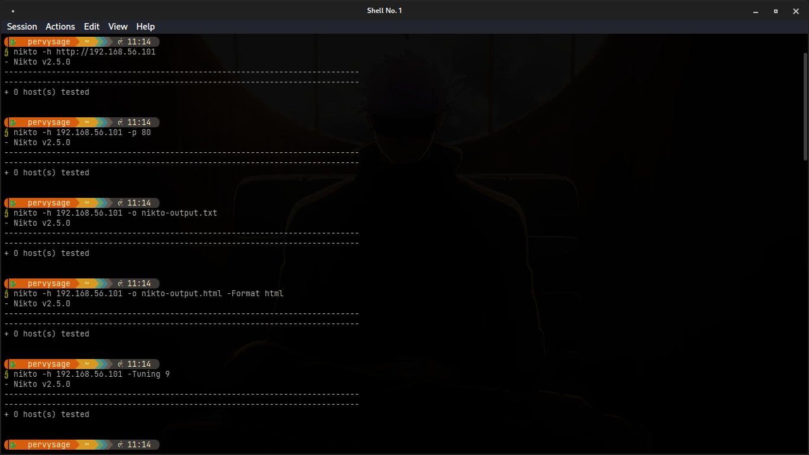
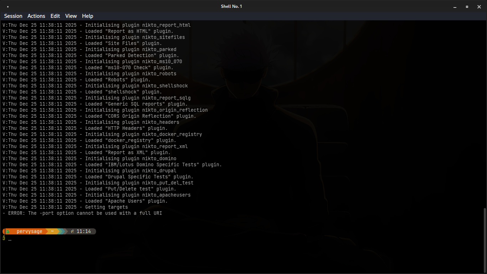
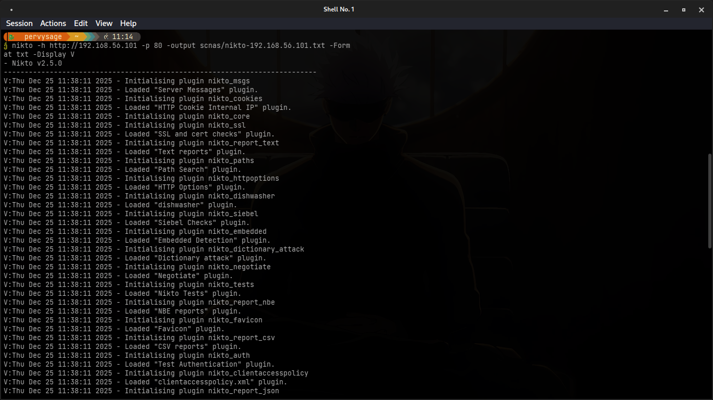

# Lab Report — Vulnerability Scanning with Nikto

Date: 2025-12-25  
Author: Hisokarh

## Objective
Use Nikto to scan a vulnerable web application and report findings, evidence (screenshots), and remediation recommendations.

## Lab environment
- Scanner: Kali Linux (fully updated)  
- Target: Metasploitable2 (IP 192.168.56.101)  
- Network: Host-only / isolated lab network

## Setup and verification
1. Start the vulnerable VM/container and confirm IP (example: 192.168.56.101).
2. On Kali install Nikto:
   - `sudo apt update && sudo apt install -y nikto`
3. Verify Nikto:
   - `nikto -Version`

## Corrected Nikto commands used
- Create output directory:
  - `mkdir -p scans`
- Run using full URL (recommended):
  - `nikto -h http://192.168.56.101 -o scans/nikto-192.168.56.101.txt -Format txt`
  - `nikto -h http://192.168.56.101 -o scans/nikto-192.168.56.101.html -Format htm`
- Or run using IP + port:
  - `nikto -h 192.168.56.101 -p 80 -o scans/nikto-192.168.56.101.txt -Format txt`
- Notes:
  - Do NOT use `-p` together with a full URI (http://...). Either supply the bare host/IP and `-p` OR supply the full URL and omit `-p`.

## Screenshots / Evidence
  
Figure 1 — Nikto startup and brief output showing version and readiness.

  
Figure 2 — Plugin initialization and example error message ("The -port option cannot be used with a full URI") — this occurs when running `-p` and `http://` together.

  
Figure 3 — Important findings saved in `scans/nikto-192.168.56.101.txt`.

Full saved report files (included in repo):
- scans/nikto-192.168.56.101.txt
- scans/nikto-192.168.56.101.html

## Findings and observations
- Directory indexing or exposed admin directory
  - Evidence: `/admin/` returned 200 and directory listing (see scans/nikto-192.168.56.101.txt and Figure 3)
  - Risk: Information disclosure, potential entry point
  - Remediation: Disable directory listing (Apache: `Options -Indexes`), restrict access via auth or IP

- phpinfo() page present
  - Evidence: `/phpinfo.php` returned full PHP config (Figure 4)
  - Risk: Credentials/environment leakage
  - Remediation: Remove `phpinfo.php` from production and restrict to dev machines

- Missing security headers (X-Frame-Options, X-XSS-Protection)
  - Evidence: Nikto reported missing headers (scans/nikto-192.168.56.101.txt)
  - Remediation: Add headers like `X-Frame-Options: DENY`, `X-XSS-Protection: 1; mode=block`, CSP.

- Outdated server components (Server and X-Powered-By headers)
  - Evidence: Server/Retailer banners revealed Apache/PHP versions (scans/nikto-192.168.56.101.txt)
  - Remediation: Patch/upgrade packages and remove version banners.

## Remediation checklist
- Remove development/test pages (phpinfo, example scripts).
- Disable directory listing.
- Harden HTTP headers (CSP, X-Frame-Options, X-XSS-Protection, HSTS).
- Limit allowed HTTP methods; disable PUT/DELETE if unused.
- Upgrade server software; apply OS security patches.
- Use firewall / network segmentation to restrict access.

## Conclusion
Nikto quickly enumerated common web server misconfigurations and known issues. Follow up with manual verification, prioritise remediation and re-scan to confirm fixes.
